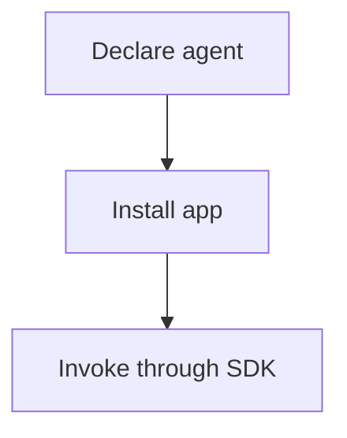

# dan.rio

| Field | Value |
| --- | --- |
| Author(s) | Daniel Cavalli |
| Date | 2026-09-05 |

Write a post once, localize it into the other language, and publish static HTML.
The source owns the writing. Accepted translations are versioned content;
builds render them without model calls or translation cache writes.

## Publish and preview

With DanCLI installed, the blog is discoverable from any working directory:

```bash
dan blog                        # translation status
dan blog build                  # strict build and validation
dan blog serve                  # localhost preview, Ctrl-C to stop
dan blog --help                  # commands and options
dan --clean meta describe blog  # machine-readable discovery
```

DanCLI finds this checkout from the current directory or the configured Work
root. Use `--path /path/to/blog` or `DAN_BLOG_ROOT` for another checkout. It runs
the blog engine with locked dependencies through `uv`; Python command details
stay in the adapter. The engine also works independently:

```bash
uv sync --all-extras --locked
uv run python _source/build.py --strict
uv run python -m http.server 8000 --bind 127.0.0.1
```

A normal build renders accepted translations without calling a model. HTML and
internal links are checked before publication. Missing or outdated translations
stop the build while preserving the previous generated site.

## Write the source

Posts live in `_source/posts/`, in either EN-US or PT-BR. The frontmatter owns
the title, date, excerpt, tags, and source language:

```markdown
---
title: A thought worth following
date: 2026-09-05
lang: en-us
excerpt: What the reader will understand.
tags: [engineering]
---

The opening develops the point promised by the title.

## What follows from it

The next part of the argument.
```

Use the three authoring references together: [composition](.agents/skills/editorial-line/references/blog-composition.md)
for the argument and its shape, [prose](.agents/skills/prose-style/references/prose-contract.md)
for connected sentences, and [voice](.agents/skills/writing-style/references/WRITING_STYLE.md)
for Daniel's way of reasoning with the reader. They guide writing and editorial
review; successful rendering alone cannot establish editorial quality.

The translation pipeline reads those references as context for the already
written source. V2's [locale rules and references](_source/translation_v2/references/)
guide natural PT-BR and EN-US expression while preserving the argument, evidence,
qualifications, emphasis, and humor. It does not edit source files or impose a
new outline. A change to policy, model, or renderer leaves accepted text valid.

After writing or editing a post:

```bash
dan blog status
dan blog translate <post-slug>
dan blog build
dan blog serve
```

Translation updates missing or outdated content and explicit revision requests.
Unchanged accepted translations are reused. For a model trial or a policy
revision, use a candidate, inspect its diff, and accept it deliberately; the
[operations guide](docs/translation_v2_opencode_runbook.md#model-upgrades-and-revisions)
owns that workflow and recovery instructions.

## Article outline and sidenotes

Articles show every heading and subheading in a sticky left outline, with notes
beside their citations on the right. The active section follows the reader.
On smaller screens, the outline folds into “On this page” and tapping a citation
opens its note after the paragraph. Repeated citations share one note.

Write notes using ordinary Markdown footnotes:

```markdown
The claim needs some context[^context].

[^context]: Supporting detail, including **formatting** and [sources](https://example.com).

    Indent subsequent paragraphs to keep them in the note.
```

Let the renderer number native footnotes by first use. Keep semantic note labels
stable across edits and languages. Do not add a Sources heading or return links
for these notes; they appear beside the passage they support. A bibliography with
independent reading material remains part of the article.

Existing numbered references and `footnote-*` anchors also become sidenotes.
Original links remain valid across languages. Without JavaScript, the outline
stays open and notes appear after the article; printing includes every note.
The layout follows the margin approach in
[Thinking Machines’ article](https://thinkingmachines.ai/blog/a-safe-path-to-open-weights/)
while retaining this blog’s typography and themes.

## Figures that follow the blog theme

Use a `theme-media` figure with `light` and `dark` variants. The existing blog toggle
selects the matching image, including when it overrides the operating system theme.
With no saved choice, the images follow the system. Printing selects the light image.

```html
<figure class="post-figure theme-media">
  <a data-theme-variant="light" href="/static/images/example-day.jpg">
    
  </a>
  <a data-theme-variant="dark" href="/static/images/example-night.jpg">
    
  </a>
  <figcaption>Context for the image.</figcaption>
</figure>
```

Only the selected variant is visible and exposed to assistive technology. A variant
can also be a native `picture` element with `source` entries for different viewport
sizes. Supply the dimensions of each source so the browser reserves the correct space.

The Hub screenshots come from `_source/tools/capture_mare_hub.mjs`, which requires
Playwright and a local Hub frontend on port 4173. It supplies sample API responses
inside the capture browser; it does not connect to a live account. Set
`PLAYWRIGHT_MODULE` if Playwright is outside the Node module search path and
`MARE_SOURCE_REVISION` to record the frontend revision in the capture metadata.

## Mermaid diagrams

Use a fenced `mermaid` block in a post. Keep diagrams small, prefer a vertical flow
for mobile reading, and give each diagram an accessible title and description:

````markdown


An installed definition is ready for the app to invoke.
{: .diagram-caption}
````

The shared runtime loads pinned Mermaid 11.17.2 from jsDelivr only on pages that
contain diagrams. It uses the blog's font and colors and renders again after theme
changes or internal navigation. If JavaScript or the CDN is unavailable, the fenced
source remains readable. See the [Mermaid theme documentation](https://mermaid.js.org/config/theming.html).

With the blog served locally, run `node tests/browser/mare-article.mjs` to check
theme changes, navigation, mobile diagrams, and image selection. Set `BLOG_URL`
for a server other than `http://127.0.0.1:8000`, and `PLAYWRIGHT_MODULE` if needed.

## Link to another post

Use the source Markdown path as the link destination:

```markdown
[Don't outsource the thinking](_source/posts/dont-outsource-the-thinking.md)
```

From another post, `dont-outsource-the-thinking.md` and
`./dont-outsource-the-thinking.md` work too. Absolute paths inside this checkout's
`_source/posts/` also work; relative paths remain portable between machines.

The renderer reads the target's frontmatter slug and links to its page in the
reader's language. Add `#heading-id` to link to a section; source heading IDs remain
stable in translations. Query strings and fragments are preserved. This works in
articles, sidenotes, reference-style Markdown links, and presentations.

Source paths remain unchanged in authored Markdown and accepted translations.
Missing post files and broken heading links fail the build before publication.
External URLs, existing published links, and code examples keep their meaning.

## Check and publish

```bash
uv run --extra dev pytest tests/ -q
uv run --extra dev ruff check .
uv run --extra dev pyright _source
dan blog check
```

`dan blog build --post <post-slug>` renders one bilingual article while preserving
the indexes, sitemap, other posts, and About/CV pages. A complete build renders
each article and collection once. Both paths validate the complete proposed site
before replacing generated files; failures preserve the previous publication.

The browser checks in `tests/browser/` cover outlines, sidenotes, mobile reading,
printing, navigation, images, diagrams, and the source corpus. See the
[operations guide](docs/translation_v2_opencode_runbook.md#verification) for commands.
The [publishing review](docs/publishing-review.md) records compatibility results
for the existing posts and the limits of local verification.

Commit source changes, accepted revisions under `_source/translations/`, and the
generated `en/`, `pt/`, `index.html`, and `sitemap.xml` together, then use the normal
GitHub Pages workflow. `_cache/` contains disposable execution state; it is not
where accepted writing lives. Architecture decisions are in [docs/adr/](docs/adr/).
