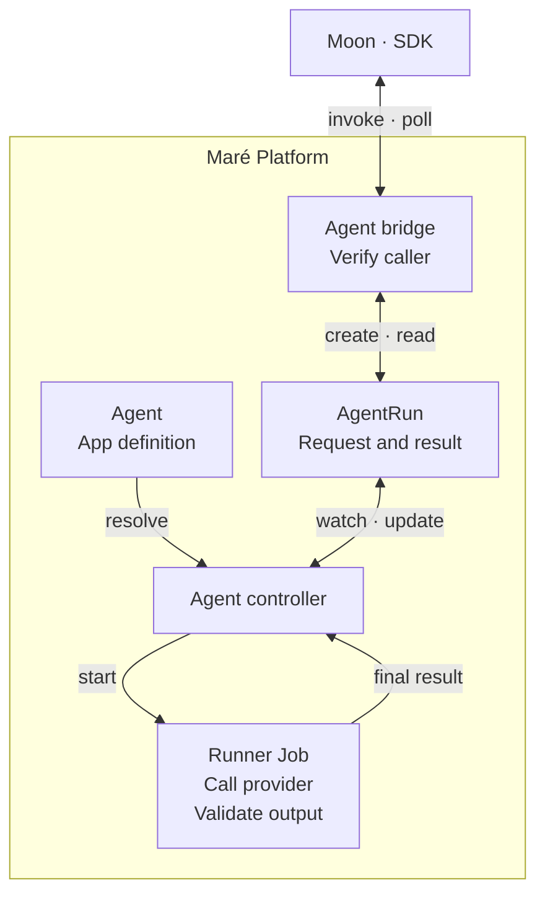

I've been using AI for development since 2022 and, as I mentioned in [Don't Outsource the Thinking](https://dan.rio/en/blog/dont-outsource-the-thinking.html), I eventually stopped writing code myself. But even so, only this year did it finally click that I really am not the bottleneck anymore. That has made a rather curious kind of software practical now: applications built around my own habits, with no particular obligation to be useful to anyone else but me! A tool can be worth building because it suits the way I organize my notes, understand my finances, or decide what to watch. It doesn't need a market.

The more apps I want, though, the less sense it makes to treat each one as a fresh engineering exercise. While my preferences may change from app to app, authentication, storage, and background execution mostly don't. Asking an agent to reconstruct those parts each time spends tokens on decisions I've already made and then leaves me with several implementations to maintain. Each with its own weird variation of those choices.

Even though agents have made writing that code cheaper, I would still prefer to avoid needing to spend my hard-earned money on the same task again.

[Maré Rio](_source/posts/mare-rio-and-mare-hub.md) is the personal software environment I've been building around that preference. By giving the apps a common foundation, I can keep those engineering decisions settled while my agents work on whatever makes each app worth having. The apps keep their own purposes and data, but I use them together through Maré Hub, shown below. Agent execution now belongs to that common foundation too, so adding an agent to an app can be as small a task as writing a JSON definition against a contract the coding agent can discover.

<figure class="post-figure theme-media">
  <a data-theme-variant="light" href="/static/images/mare-agent/hub-day.jpg"></a>
  <a data-theme-variant="dark" href="/static/images/mare-agent/hub-night.jpg"></a>
  <figcaption>Maré Hub, shown here with sample app data.</figcaption>
</figure>

## An agent for Moon

Moon, my watchlist app, already had a recommendation system; what I wanted from an agent was a way to notice connections beyond genre. I might have liked a film for its director, its tone, or the way it treats a subject, none of which is captured particularly well by classifying it as science fiction.

Taking my viewing history to a chat would get me an answer, but it would also make me the integration between the app that holds the information and the agent that can use it. Since Moon already has both the history and a place for the recommendations, I wanted it to make that request itself.

The request I wanted to give my coding agent was to write a prompt and connect it to that feature. Choosing an agent framework, building an execution harness, and connecting provider accounts would turn a small improvement to my watchlist into another infrastructure project. Those things have to exist somewhere, of course; putting them in Maré means they are available the next time I want an app to do something similar.

Scout is the agent Moon runs for this purpose. With my viewing history, ratings, watchlist, and existing recommendations as context, it looks for a few additions and explains each through a connection to that history. Whether I ask it for something familiar or something I probably wouldn't have found myself makes a considerable difference to the request, even though the input is the same. That preference goes into the prompt, where I can revise it after seeing what Scout makes of it.

## A contract my coding agents can discover

For the coding agent, this capability needs to be discoverable during the session in which it is building the app. Otherwise I would still have to explain the platform each time, and hope the explanation survived until it was needed. Maré's command-line interface (CLI) lets the agent inspect the available commands and their contracts: the inputs they accept, their effects, and whether they require interaction. Because those descriptions come back as JSON, the agent can consult them as part of its work.

With Scout, that can begin by inspecting the creation command and then using it:

```bash
mare --json meta describe app.agent.create

mare --json app agent create scout \
  --purpose "Propose watchlist-worthy movies and TV shows from the tenant's taste signals"
```

What the command leaves behind is a valid starting definition, registered in the app's deployment manifest, together with directions for refining it and a link to the agent reference. The coding agent can work from those instructions and validate its changes against the same compiler used for creation and deployment preparation. An unsupported field therefore produces a finding it can act on while it is still working on the definition.

The file describes the work in terms that belong to the app: what the agent is being asked to do, which capabilities it needs, what answer is expected, and how much it is allowed to spend getting there. This excerpt from Scout's definition, with the instructions shortened, shows the shape of that request:

```json
{
  "id": "scout",
  "instructions": "Suggest titles the current recommendations missed. Explain each choice using the supplied viewing history.",
  "workload": {"profile": "analysis"},
  "tools": {"operations": [], "packs": []},
  "budget": {"perRunTokens": 20000, "perDayTokens": 60000},
  "timeoutSeconds": 600
}
```

The [full Scout definition](/static/examples/mare-agent/scout.agent.json) also specifies the output schema, so the coding agent can build Moon's handling of the answer around known fields. A suggestion carries a title, media type, reason, and confidence value. Scout has up to 20,000 tokens for a run, within a daily allowance of 60,000, and ten minutes to finish; those limits travel with the definition as part of the request the platform agrees to execute.

Since Moon supplies the context Scout needs, its tool lists are empty. For a task that required more information, the same contract allows the coding agent to name an operation exposed by another app, such as searching Notes, or request the platform's browser <a id="first-use-agent-pack"></a>AgentPack<sup>[1](#footnote-agent-pack)</sup>. Maré supplies those capabilities when the task runs, without making the app's authoring process depend on how the corresponding services are deployed.

## How Maré executes a run

On the platform side, Scout's definition becomes an Agent resource in Kubernetes, which already runs the rest of Maré. The definition is reused across requests, while each execution gets its own <a id="first-use-agent-resources"></a>AgentRun<sup>[2](#footnote-agent-resources)</sup> and, once admitted, a Kubernetes Job. Keeping the request as a resource in its own right gives the controller somewhere to record the execution settings, progress, and result, independently of the Job doing the work.

Moon creates a run when it needs recommendations, but a schedule or an event can start the same kind of work. A notes app might request a review each morning, for example, or when a note is captured. The controller processes the resulting AgentRun in either case. More particular conditions, such as whether enough new material has accumulated to make a review worthwhile, remain in application code, where the meaning of that material is understood.



Moon's request and its result live on the same AgentRun. The arrows show the polling path through the bridge and the controller's work inside Kubernetes.
{: .diagram-caption}

### Admitting the run

A request from Moon has to establish both which app is asking and on whose behalf. Its software development kit (SDK) carries those identities to Maré's agent bridge, which verifies them and checks that the app is installed and ready for the tenant. In Moon's case, that tenant is the household whose data and provider accounts will be used. Scout's definition belongs to the app, but the run belongs to the household, allowing the definition to be shared without combining the requests or their results.

Model selection follows the workload requirements in the definition. Scout asks for `analysis`, with requirements for reasoning level and structured output; a shared routing policy resolves that description to a provider and model, using the accounts I connect in the Hub. This is a choice I can change across my apps without revisiting each definition. A missing connection to the selected provider or an exhausted budget stops the request at admission, before the controller creates a Job.

Changing Scout while it is running shouldn't change the job halfway through. At admission, the controller records the resolved instructions, tools, routing decision, and limits on the AgentRun, and the Job runs from that snapshot. Later edits therefore affect later requests, leaving me with a record of the prompt and model behind a recommendation even after I've moved on to another version.

### Recording and delivering the result

The result returns through the same AgentRun that recorded the request. After calling the provider and checking the answer against Scout's output schema, the runner reports its final result to the controller, which stores it alongside the status and token usage. A missing or malformed result makes the run fail, leaving Moon to handle that outcome through the platform's contract rather than interpret an incomplete provider response.

From Moon's side, waiting for Scout amounts to an SDK call that polls the AgentRun through the bridge. A feature with no reason to wait can instead receive the result in an asynchronous handler and continue its own work in the meantime. That path uses a Redis stream with delivery that may repeat, so the handler has to tolerate receiving the same result twice.

## What Moon does with the answer

By the time Scout's answer reaches Moon, the platform has checked its structure, but only the app can decide how it belongs in the recommendation list. Moon matches suggested titles to its catalog and removes duplicates, so a plausible name alone doesn't qualify for inclusion. If Scout fails or Moon stops waiting for it, the usual recommendations remain available. The agent's contribution fits around the feature that already works.

Whether those additions make the list more interesting is something I still have to judge. A recommendation can be perfectly well formed and still miss what I liked about a film; in that case, I have something specific to discuss with my coding agent about Scout's instructions or the context Moon supplies. Having the execution machinery already in place lets that conversation stay with the feature, instead of expanding once again into how to run an agent.

---

<a id="footnote-agent-pack"></a>
**[1] AgentPack:** A platform-owned bundle of instructions or tool services. The browser pack supplies a browser through the Model Context Protocol (MCP), the interface the runner uses to call its tools. [Back to text.](#first-use-agent-pack)

<a id="footnote-agent-resources"></a>
**[2] Agent and AgentRun:** Custom Kubernetes resource types. Custom Resource Definitions (CRDs) make these types available through the Kubernetes API; controllers implement their behavior. [Back to text.](#first-use-agent-resources)
